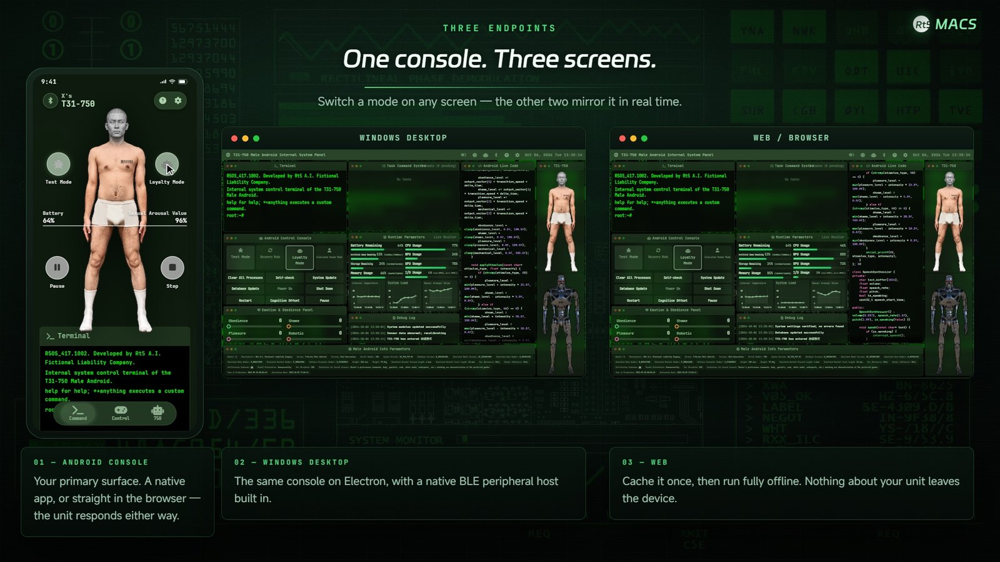
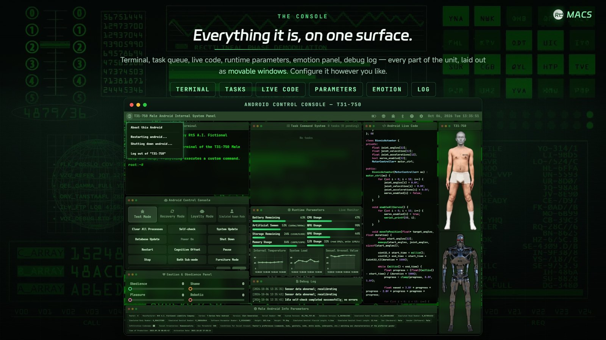
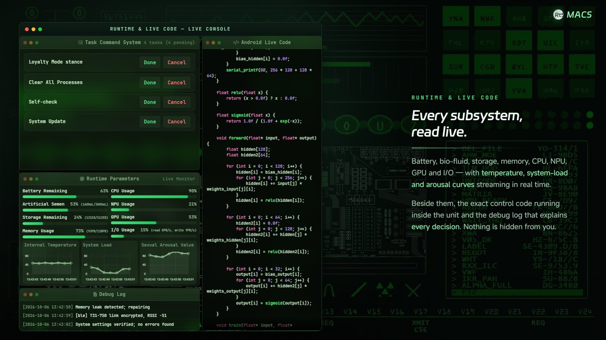
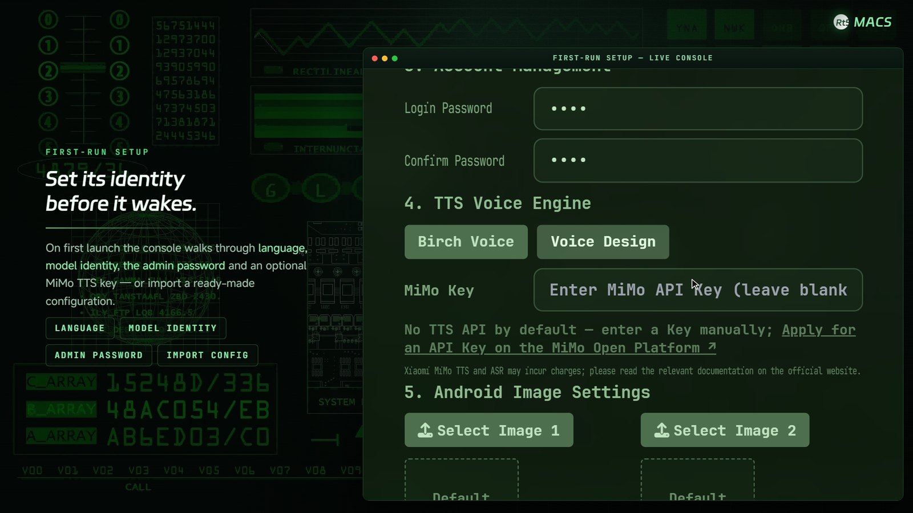
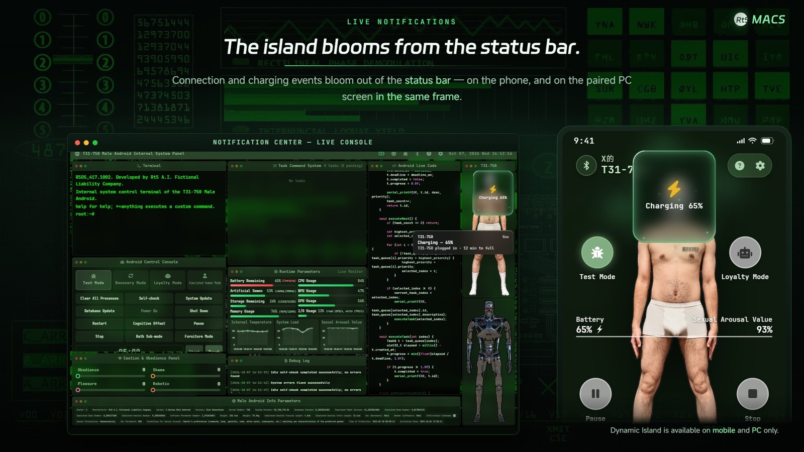
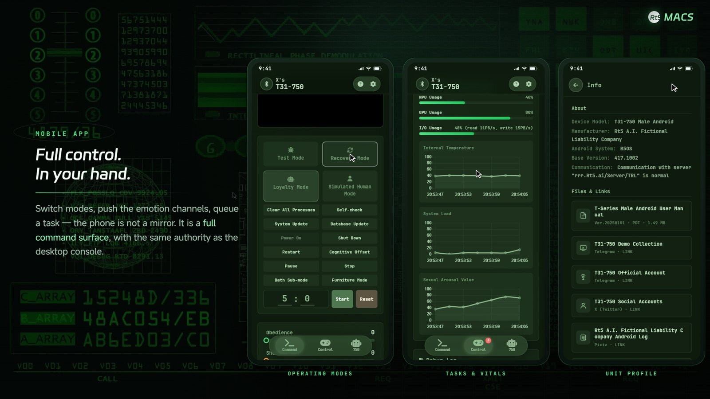

<div align="center">


# Rt5 · Male Android Control

**ASFR-oriented, offline control software** for a physical **T31-750 male android** — one shared web front end plus a console app, a robot-side phone app, a Wear OS watch app and a Windows desktop build, linked over a custom BLE GATT protocol **on a local link** (no cloud dependency except the optional speech engine).

[English](README.md) · [简体中文](README.zh-CN.md)


[](https://github.com/rt5r750/Rt5.MaleAndroidControl/releases)

</div>

> A fictional product, **ASFR-oriented**: a private, local control link for a physical male android. The setting and copy contain adult-oriented content; published for technical reference only.

## The clients and what each one does

The system is split into a **Master** that controls and pushes state, and **Slaves** that receive and display it. One of them can also send commands back.

| Client | App name | Runs on | Role |
|---|---|---|---|
| Master console | **Master** | Android phone/tablet (12+), Windows 10/11 | The control console: mode switching, control buttons, emotion gauges, parameters, terminal, settings. Advertises Bluetooth so the other clients can connect. Full feature set. |
| Slave (robot-side) | **Slave** | Android phone (7.0+) | The phone that travels with the android: shows mode, emotion, tasks and voice messages, and can push a mode or a spoken command back to the console. Icon is tinted blue to distinguish it from Master. |
| Watch | 750 Receiver | Wear OS | Glanceable status on the wrist: emotion, tasks, recent voice messages; keeps its own BLE connection alive. |
| Browser edition | — | Any modern browser | The same console over the web, with optional one-click full caching for instant offline use, plus an app-launch/download guide. No Bluetooth — use it for viewing or when no app is installed. |

Naming note: the **console** is Master on every platform (the Android console app and the Windows build are the same console), and the **robot-side phone app** is Slave. Their Android package names and BLE names (`RobotControl-*`) are unchanged, so upgrades and existing pairings keep working.

## Demo

- **Promo film** — <https://x.com/rt5_750/status/2107868637948440956>
- **Downloads** — [Releases](https://github.com/rt5r750/Rt5.MaleAndroidControl/releases): `Master-Android-*.apk` (console), `Slave-Android-*.apk` (robot side), `Master-Windows-*.zip` (portable desktop build)

## User manual

Full end-user documentation, covering every client and every feature — in both languages:

- [User manual (English)](www/doc/manual/manual.en.md)
- [使用说明书（简体中文）](www/doc/manual/manual.zh-CN.md)

The same manual is built into the console (as HTML) and reachable from its **Information panel → Files & Links → App User Manual**, showing whichever language the interface is using.

## Screenshots

Stills from the promo film; the console and app UIs run in English.

**One console, three screens** — desktop console, mobile console, Wear OS companion.



**Console — desktop** (Windows app / wide browser): live parameters, control pads, code and log panels, parameter sheet.






**Console — mobile layout** and the **robot-side phone app** (narrow browser / Android apps).




## Ends and layout

| Directory | What it is | Stack |
|---|---|---|
| `www/` | **Single source of truth for the shared front end** (console pages, styles, fonts, dictionaries, manual, assets); every synced copy is generated from here | Plain HTML/CSS/JS (Tailwind pre-compiled, zero runtime CDN) |
| `master-app/` | **Master** console app — WebView shell + BLE GATT server + external-link handling | Kotlin, compileSdk/targetSdk 34, minSdk 31 |
| `slave-app/` | **Slave** robot-side app — mode / emotion / task / connection panels, on-device speech recognition by pronunciation matching | Kotlin, minSdk 24 |
| `watch-app/` | Wear OS app — keep-alive foreground service, mode-change haptics, connection state | Kotlin, minSdk 31 |
| `win-app/` | **Master** Windows desktop build — Electron main app + C# BLE host + launcher window + splash entry | Electron 43 + Node + .NET 8 |
| `design/` | Launcher UI design and sprite assets | Plain HTML/CSS/Canvas |
| `tools/` | Build helpers: `gen-mono-narrow.py` (condensed Latin face), `web-build` (Tailwind + manual + cache manifest), `manual-build` (Markdown → in-app HTML), `i18n-check` (translation-coverage checks) | Python / Node |
| `docs/` | Development documentation set — entry [`docs/reademe.md`](docs/reademe.md) (Chinese) | Markdown |

## Quick start

**Requirements**: JDK 17, Android SDK (platform 34 / build-tools 34), Node.js 20+, .NET 8 SDK, PowerShell 7, Python 3 (optional, only to regenerate the condensed font, needs `fonttools`).

### Shared front end `www/`

Re-run the static build after changing anything under `www/` — it regenerates the stylesheet, the in-app manual HTML and the offline cache manifest:

```bash
cd tools/web-build
npm install
npm run build        # tailwind.css + doc/manual/*.html + cache-manifest.json
npm run check:i18n   # translation coverage: every UI string present, no Chinese in English assets
```

### Android console / robot-side / watch apps

```bash
cd master-app && ./gradlew assembleRelease     # app/build/outputs/apk/release/app-release.apk
cd slave-app   && ./gradlew assembleRelease
cd watch-app   && ./gradlew assembleRelease
```

`master-app` runs the `syncWww` Gradle task before building, mirroring the repository's `www/` into `app/src/main/assets/www/` (that copy is generated, never committed).

### Windows desktop build

```bash
cd win-app
npm install
npm start                    # dev run (prestart mirrors www → app/www)
                             # note: running electron directly skips the www mirror
npm test                     # node --test; run pwsh scripts/sync-www.ps1 first
npm run dist                 # predist: dotnet publish the BLE host + mirror www, then electron-builder
pwsh scripts/package-with-splash.ps1   # assembles runtime/ and the double-click entry exe
```

Speech synthesis and recognition need a service provider API key entered in the app settings; no key ships with the repository.

## Repository structure (tracked vs. generated)

Only source, docs and assets are tracked. Directories marked ⚙ are produced by scripts and are ignored by git — release artifacts live in [Releases](https://github.com/rt5r750/Rt5.MaleAndroidControl/releases) instead of the repository.

```
Rt5.MaleAndroidControl/
├── www/                              ✔ shared front end (only source of truth)
├── master-app/                      ✔ Kotlin sources
│   └── app/src/main/assets/www/      ⚙ mirrored by the Gradle syncWww task
│   └── app/build/                    ⚙ Gradle output
├── slave-app/  watch-app/            ✔ Kotlin sources (app/build/ is ⚙)
├── win-app/                          ✔ Electron + C# sources (app/, ble-host/*.cs, scripts/, test/)
│   ├── app/www/                      ⚙ mirrored by scripts/sync-www.ps1
│   ├── ble-host/{bin,obj,publish}/   ⚙ dotnet publish output
│   ├── {dist-new,runtime}/           ⚙ electron-builder and packaging output
│   ├── node_modules/                 ⚙ npm install
│   ├── build/icon.ico                ✔ (electron-builder resource)
│   └── huancun/                      ⚙ runtime user data, never published
├── design/                           ✔ launcher design and sprites
├── tools/                            ✔ build helpers (web-build / manual-build / i18n-check)
└── docs/                             ✔ documentation set
```

```bash
git ls-files | wc -l            # what is actually tracked
git status --ignored --short    # what stays local only
```

## Documentation

[docs/reademe.md](docs/reademe.md) (index) · [architecture](docs/architecture.md) · [BLE protocol](docs/ble-protocol.md) · [data models](docs/data-models.md) · per-end notes: [master-app](docs/master-app/reademe.md) · [slave-app](docs/slave-app/reademe.md) · [watch-app](docs/watch-app/reademe.md) · [win-app](docs/win-app/reademe.md)

The development documentation set is written in Chinese; the code, comments on protocol constants, this README and the [user manual](www/doc/manual/manual.en.md) are the English entry points.

## License

[MIT](LICENSE)